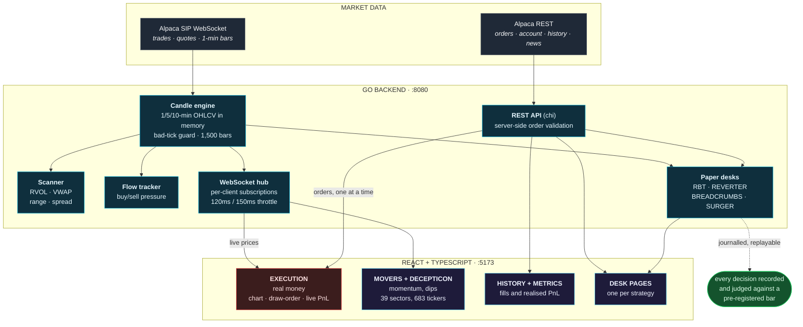

# Earth-Altra: a quantitative trading platform for mean reversion with ML pipelines


A real-money US-equity terminal, statistical mean reversion, LightGBM gates, and a rule
that nothing ships until the evidence says so.

> **The one hard rule:** the user's money is real; **every strategy runs on its own paper
> account with its own keys.** No strategy has a code path to the real account, and nothing
> auto-trades real money. Every real order passes a confirm modal. Not financial advice.

---

## How it fits together



Go backend (one SIP feed, in-memory candles, WebSocket fan-out, chi REST) · React front
end · LightGBM where a model earns its place. That's the whole "how" here, the rest of
this page is what it *does*.

*Curious how it's built?* → **[Architecture in detail](ARCHITECTURE.md)**

---

## What you can actually do with it

### 🛡️ The safety layer: *the part that matters most*

- **Nothing trades itself.** Every real order stops at a confirm modal. You always press
  the button.
- **The fat-finger catcher.** A *buy* limit placed above the market looks patient but fills
  instantly. That mistake is the reason this exists. It's blocked in the panel, explained
  in plain English at the confirm step, and re-checked on the server before it can reach
  the broker.
- **Can't sell what you don't have**, can't exceed your order-size cap, can't put a stop on
  the wrong side of the price.
- **One-click kill switch** cancels every open order at once.
- **Paper and real money are physically separate**: different accounts, different keys,
  no shared path between them.

### 💹 The execution layer: *where you actually trade*

- **Every order type you need:** market, limit, stop-loss, trailing stop (dollars or
  percent), OCO (target and stop together, first one wins), and bracket (entry + target +
  stop submitted as one).
- **Draw your order on the chart.** Click the price you want while candles are still
  forming, the popup offers only the order types that make sense at that level.
- **Buy in shares or in dollars**, whichever way you think.
- **Live positions and P&L** beside the chart, with your entry marked as a line so you
  always see where you stand.
- **Account header** with equity, day P&L and buying power, updating on every tick rather
  than every few seconds.

### 🔍 The intelligence layer: *what's worth looking at right now*

**MOVERS, momentum and dips**

- Whole-market **top gainers and losers**, live.
- **Risers**: names climbing off the open, scored on how far they've come, how unusual the
  volume is, and where they sit against VWAP. One number for "is this real, or noise?"
- **Faders**: the same treatment for names rolling over. This is where dip entries come
  from.
- Every row shows range, distance from VWAP, a signal grade, a suggested entry and an exit
  read.
- Click any row for a live chart, even of a stock nobody was tracking a second ago.

**DECEPTICON, sectors and catalysts**

- ~683 tickers watched across **39 sector departments** (AI infrastructure, semis, quantum,
  nuclear, biotech, defence…).
- Each department opens into a **summary card**, is the whole sector moving, and who's
  leading it?
- A **mini-chart heatmap** of every ticker inside, click to enlarge.
- **Catalyst flags** tell you *why* something is moving, not just that it is.
- **High-volume markers** for names trading far above their normal.
- A **catalyst radar** across all 39, so a sector waking up shows up before it's obvious.

### 🧭 The assist layer: *help deciding, never deciding for you*

- **Bollinger bands and RSI** on the chart, with a synced RSI pane below it.
- A **signal badge** grading the setup **STRONG / WEAK / WAIT**, strong only when two
  independent signals agree.
- **News with sentiment** for whatever you're holding, plus a one-click "why is it moving"
  summary.
- **Any timeframe:** 1-, 5- or 10-minute intraday, or a week to a year of history.
- These inform you. **None of them can place an order.**

### 📒 The receipts layer: *what actually happened*

- **History**: every fill, straight from the broker. Not a local guess.
- **Metrics**: realised P&L rebuilt from actual fills, so partial fills and averaging
  can't quietly distort the numbers.
- **Watchlist**: your names as stacked live charts, drag to reorder, ranked by how far
  they've moved since the open.

### 🧪 The laboratory: *the experiments running beside you*

- **Four strategies trading paper accounts**, each with its own page showing open
  positions, P&L, and every closed trade with the reason it closed.
- They share your market data feed but **can never touch your money**.
- Every decision is written down so it can be replayed and judged later, which is how two
  ideas already got killed instead of shipped.

## The paper desks

Four strategies trade paper accounts alongside the terminal, each an experiment with a
pre-registered success bar. Three of them bet on prices coming *back*, which is the house
thesis. The fourth, SURGER, deliberately bets the opposite way, on moves carrying on,
because a platform that only ever tests its favourite idea learns nothing about when that
idea is wrong.

### RBT: Rubber-Band Trading

**The idea:** two stocks that normally move together drift apart; the band snaps back.

- **Scans once a day**, in the last ten minutes before the close. No intraday babysitting.
- **199 liquid names**, screened for genuine cointegration, not a hunch list.
- Enters only when a pair is stretched **2σ or more**; a LightGBM model ranks the
  candidates so only the **top 5** get capital.
- **Trades both directions**: long the cheap leg, short the rich one.
- **Five slots, equal weight** (~$20k each), so no single idea dominates the book.

**Why you'd want it:** it's the calm one. Positions are *meant* to sit for days, so a red
afternoon means nothing. Each has four independent ways out, the target, a daily-close
stop, an emergency stop resting at the exchange, and a hard five-session deadline, so
nothing drifts forever. A recent example: **GOOGL, held two sessions, +$709.**

→ **[Read more about RBT](strategies/RBT.md)**

### REVERTER: the twitch trader

**The idea:** within a single minute, price overshoots its own short-term average. Buy the
overshoot, sell the snap-back.

- Fires when a stock drops **1.5σ below its 15-minute mean**, exits when it returns.
- Holds for **minutes**, often under five. Hundreds of small round trips a day.
- A hard floor at 4σ and a **15:55 flatten**: it never carries risk overnight.

**Why you'd want it:** it's the fastest measuring instrument in the system. Trading that
often answers questions in *days* instead of months, and it already answered one. Its
edge is real in the **first 30 minutes** and negative after 10:00, a pattern that has now
repeated for eight straight sessions. That finding is worth more than the P&L.

→ **[Read more about REVERTER](strategies/REVERTER.md)**

### BREADCRUMBS: the machine-learned scalper

**The idea:** in volatile names, a short-lived move is often predictable enough to take a
small, quick bite. **22 volatile stocks**, scored bar by bar, three independent yeses
required before any entry (see the pipeline below).

**Why you'd want it:** the most self-aware desk here. It benches any symbol that stops it
out twice in a day, waits five minutes before re-entering anything, and books every exit
from the broker's actual fill price rather than what it hoped to get. It's also running a
**live A/B experiment on itself**: every position cut by the $25 rule spawns a shadow
twin that keeps trading uncut, so "does this rule help?" is settled by evidence on a fixed
date instead of by opinion.

→ **[Read more about BREADCRUMBS](strategies/BREADCRUMBS.md)**, including how the model is trained and what it looks at

### SURGER: continuation detection

**The idea:** a stock already climbing with unusual persistence often keeps going. Three
detectors hunt the same prey with different noses, a **CUSUM** drift-break, a **trend
purity** score, and a **spectral** read of the day's dominant wave. Each keeps its own
book and its own trailing leash (tight for short drifts, wide for day-long waves), with
`srg1_/srg2_/srg3_` order tags so the three can never be confused. Fires roughly once
every other day by design; flat weeks cost nothing.

→ **[Read more about SURGER](strategies/SURGER.md)**

---

## What ties them together

**Nothing ships on a good story.** Every idea is replayed on historical data against a
pre-registered bar before going live, and every live desk journals enough to replay its own
decisions later. Two things that discipline has already caught:

- A knife-detection program, 14 detectors and a model with a genuine 0.81 AUC, produced
  **no dollar edge at all** once measured against a fair control. Cancelled, not shipped.
- The AI agent team this project was originally built around: **retired** after 77 graded
  trades came in at −$66, with plain deterministic math beating the model's exits.

**Safety is structural, not a promise.** Separate accounts and separate keys. Orders settled
to a terminal state before anything is booked. Cancels confirmed before a replacement is
placed. Positions reconciled against the broker on every restart.

## Run it

```bash
scripts/check-keys.ps1      # verify Alpaca keys + SIP entitlement
scripts/run-backend.ps1     # Go backend → :8080
scripts/run-frontend.ps1    # Vite dev    → :5173
```

Or `START-Live-Optimus.bat` to launch both. Keys live only in a server-side environment
file and are never committed.

## Going deeper

**Per-strategy pages** in plain language, one for each desk:
[RBT](strategies/RBT.md) · [REVERTER](strategies/REVERTER.md) ·
[BREADCRUMBS](strategies/BREADCRUMBS.md) · [SURGER](strategies/SURGER.md)

`CLAUDE.md` is the maintained technical reference, covering the architecture, every
desk's dials and the operations playbook. Research write-ups: `RUBBER_BAND_TRADING.md`, `SURGER_V2.md`,
`HARVEST_STUDY.md`, `KNIFE_STUDY.md`, `REGIME_DETECTOR_STUDY.md`, `REVERTER_FILTERS.md`.
Retired systems: `DIP_RISE_ARCHIVE.md`, `SNDK_RETIREMENT.md`, `AI_QUANT_LOG_DIGEST.md`.

---

*Personal project. Markets are hard. The point is the engineering: a system built to find
out the truth about its own ideas, and to keep real money and automated experiments
strictly apart.*
