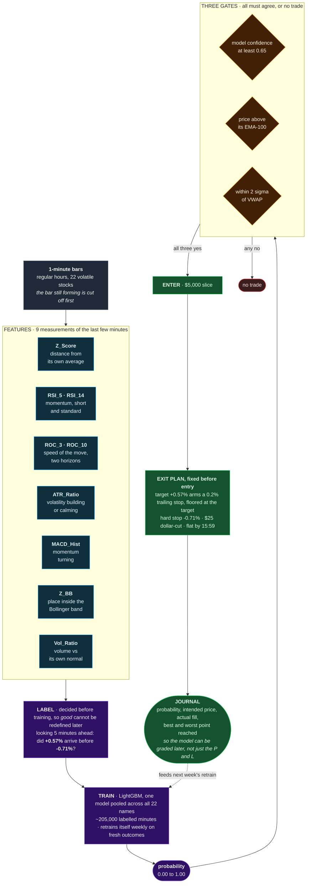

# BREADCRUMBS: the machine-learned scalper

**In one line:** in jumpy stocks, small moves are sometimes predictable enough to take a
quick bite, and a model decides which ones are worth biting.

Paper account · 22 volatile names · holds for minutes · flat every night.

---

## The idea

Volatile stocks twitch constantly. Most of those twitches are noise, but some carry on
long enough to be worth half a percent. The hard part isn't finding movement; it's
telling the two apart. So instead of writing a rule by hand, this desk **learns** the
difference from its own history: it looks at what the last few minutes looked like, and
asks how often that exact picture led to a small win rather than a small loss.

## How it decides

## The rules

| | |
|---|---|
| **Universe** | 22 deliberately volatile stocks |
| **Entry** | model ≥ 0.65 **and** above EMA-100 **and** within 2σ of VWAP |
| **Size** | $5,000 per position |
| **Target** | +0.57%, reaching it arms a 0.2% trailing stop |
| **Profit lock** | the trail can never fall back below the target once reached |
| **Stop** | −0.71% hard |
| **Dollar cut** | any position down $25 is sold immediately (see the experiment below) |
| **Cooldown** | 5 minutes before re-entering the same name |
| **Two-strike rule** | a name that stops out twice in one day is benched until tomorrow |
| **End of day** | everything flat by 15:59 |
| **Retraining** | weekly, automatically, on its own recent outcomes |

## The self-experiment

The $25 dollar-cut was an operator idea: *sell anything down $25, no matter what the
percentage stop says*. Backtests said it was roughly a wash, which is exactly the kind of
answer that gets argued about forever.

So it runs as a **live A/B test on itself**. Every time the cut fires, the desk spawns a
**shadow twin** of that position which keeps trading under the normal rules, on live
prices, as if the cut had never happened. Both outcomes are recorded side by side.

On a fixed review date the question is settled by the ledger, not by opinion. One known
bias is written down in advance: the shadow's stops fill exactly at their level with no
slippage, which flatters the "uncut" arm by a few dollars per trade, so a narrow win for
uncut counts as a tie.

## Why it's built this way

**The label came first.** +0.57% and −0.71% were chosen before training, and the live desk
uses exactly those numbers. If the model were trained on one target and traded on another,
its probabilities would be meaningless.

**Only completed bars.** An earlier version scored the bar that was still forming, a
few seconds of partial data that looked like a finished minute. It fired phantom entries.
Now the forming bar is cut off before scoring.

**It books what the broker actually got.** Exits record the real average fill price, not
the price the desk hoped for when it decided to sell. An earlier version drifted by $100
in a single day by trusting its own intentions.

**It knows when to stop.** Two stop-outs benches a symbol for the day; a five-minute
cooldown stops it re-entering into the same falling knife.

## Honest status

Live on paper, running to a fixed review date regardless of interim results. That is
deliberate, so a bad week can't trigger a panic change. The edge is regime-sensitive: the same dials
that turn a losing fortnight into a winning one in backtest do much less in a compressed
market. Treat it as a measurement desk that sometimes pays, not an earner.

## Lineage

This desk is the generalised version of an earlier single-stock scalper. The research that
produced the feature set and the volatile-basket idea:
[`SNDK_VOLATILITY_PIPELINE_STUDY.md`](../SNDK_VOLATILITY_PIPELINE_STUDY.md) ·
[`SNDK_GENERALIZED_IMPLEMENTATION.md`](../SNDK_GENERALIZED_IMPLEMENTATION.md).
[`HARVEST_STUDY.md`](../HARVEST_STUDY.md) covers a related programme that found **no**
deployable edge in small-bracket scalping, and is worth reading before proposing a new one.
