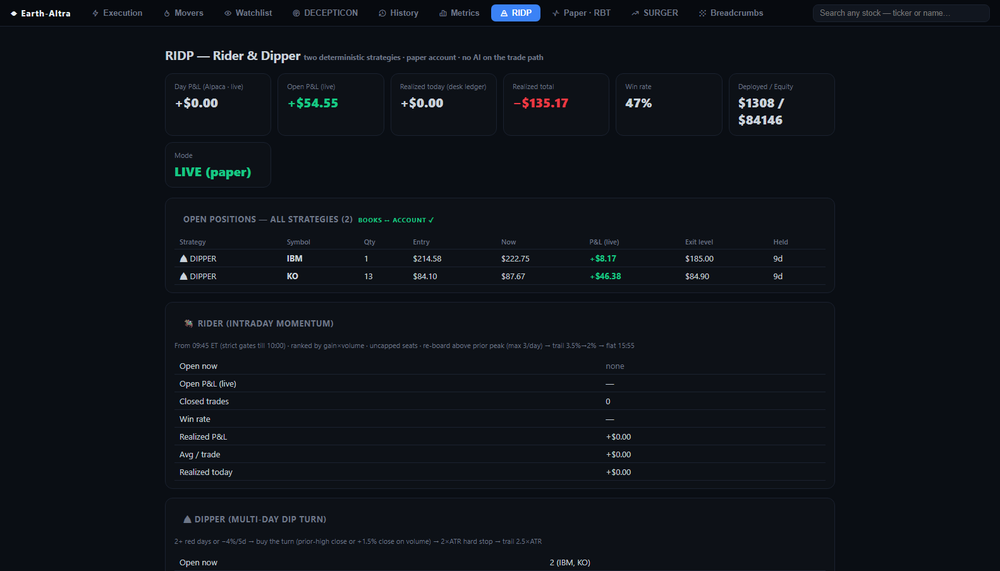

# REVERTER: the twitch trader

**In one line:** when a price overshoots its own short-term average, buy the overshoot and
sell the snap-back.

Paper account · holds for minutes · hundreds of trades a day · flat every night.

---



*The RIDP desk page, where REVERTER lives alongside RIDER and DIPPER.*

## The idea

Over a few minutes, a stock has a "normal" level: roughly its average over the last
quarter hour. Real news moves that level. Everything else is noise: a burst of selling
pushes price below where it belongs, and it drifts back.

REVERTER trades that drift. It doesn't predict direction, doesn't care about the company,
and holds for about as long as it takes to make a cup of tea.

## How it decides

```
  Every stock in the universe, every minute
            │
            ▼
  What's its average over the last 15 minutes?  And how much does it
  normally wobble around that average?
            │
            ▼
  Has it dropped 1.5 wobbles (1.5σ) BELOW that average?
            │
         yes ▼
  Buy a small slice
            │
            ▼
  Exit as soon as price returns to the average          ← the whole thesis
  ...or at 4σ, where "cheap" has become "something is wrong"
  ...or at 15:55, because nothing sleeps overnight
```

Three exits, no discretion. Most trades end in under five minutes.

## The rules

| | |
|---|---|
| **Entry** | price 1.5σ below its own 15-minute average |
| **Exit, target** | price returns to that average |
| **Exit, floor** | 4σ below. If it's fallen this far, the assumption was wrong |
| **Exit, clock** | flat at 15:55, always |
| **Hold time** | minutes, usually under five |
| **Volume** | hundreds of round trips a day |

## What it's really for

REVERTER is the **fastest measuring instrument in the system**, and that's its main job.

Most strategies here trade a few times a week, so a real answer about whether they work
takes months. REVERTER trades hundreds of times a day, which means questions get answered
in *days*. Its P&L matters less than the fact that it can settle an argument quickly.

**It has already settled one.** Sorted by time of day, its entire history says the same
thing:

| when it trades | result |
|---|---|
| **first 30 minutes (09:30–10:00)** | **the only profitable window it has ever had** |
| 10:00–11:00 | consistently the worst hour of the day |
| after 12:30 | steadily negative, low win rate |

That pattern has now held across eight straight sessions and every week of history. The
same finding turned up independently from a completely separate research programme that
never looked at this desk's records.

**But the clock isn't the whole story.** On one recent morning REVERTER was up +$43 inside
its supposedly-good window, then lost it all in twelve minutes as seventeen positions
stopped out one after another in a cascade, inside the "safe" hour. A time-of-day rule
alone wouldn't have saved that day. Whatever gets built has to handle both: the calendar
*and* the tape.

## Honest status

Running **unchanged, on purpose**, collecting a second clean week of data. Several
improvements are designed and backtested: a trading curfew, a blackout over the toxic
hour, entry filters that skip the sharpest falls, and a rule that halts everything when
several positions stop out together. **None of them are switched on.**

That's deliberate. The first week's numbers were polluted by plumbing bugs (protective
orders that failed to place, exits that bounced off stale orders). Those are fixed now, so
this week measures the *strategy* rather than the pipes. Changing the strategy in the same
breath as fixing the pipes would make both results meaningless.

## Where it lives

REVERTER is one of three strategies inside the RIDP desk, alongside RIDER (rides
established intraday trends) and DIPPER (buys multi-day dips and holds for days). They
share an account and a journal, but make entirely independent decisions.

A log-only overseer called **Guardian** watches the whole desk and records what *would*
have happened under a dozen different risk rules (desk-wide stops, profit locks, cascade
halts) without ever placing an order. Those counterfactuals are what the improvement
decisions get made from.

## Deeper

[`REVERTER_FILTERS.md`](../REVERTER_FILTERS.md) sets out the three designed entry filters
with the evidence behind them.
[`RIDP_REVERTER_FIXES.md`](../RIDP_REVERTER_FIXES.md) covers the operational fixes and the
decision docket.
